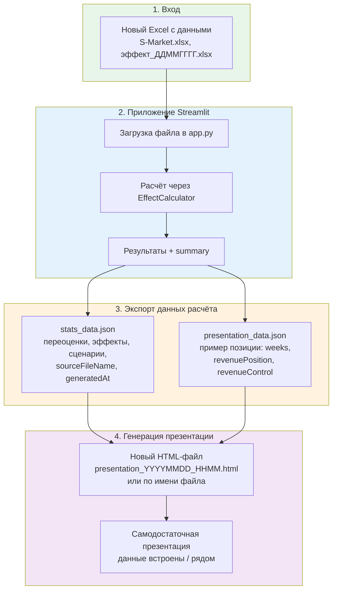

# Потоковая схема: от данных до презентации

## Шаги потока

| № | Действие | Результат |
|---|----------|-----------|
| 1 | Берёшь новый Excel с данными | Файл готов к загрузке |
| 2 | Загружаешь в Streamlit-приложение, настраиваешь параметры, нажимаешь «Применить» | `calc.calculate()` → `results`, `summary` |
| 3 | Данные экспортируются в JSON | `stats_data.json` (общая статистика) + `presentation_data.json` (пример позиции) |
| 4 | Формируется новый HTML-файл | `presentation_<имя_замера>_<дата>.html` — презентация только под этот расчёт |

## Текущее vs целевое

- **Сейчас**: `stats_data.json` и `presentation_data.json` обновляются скриптами `generate_stats.py` и `extract_data.py` вручную. `presentation.html` читает их через `fetch()` при открытии.
- **Целевое**: из приложения после расчёта — экспорт JSON и генерация отдельного HTML-файла под текущий расчёт (файл самодостаточен или всегда идёт со своим набором JSON).
